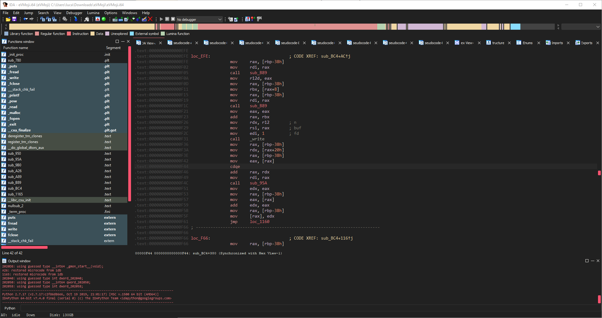
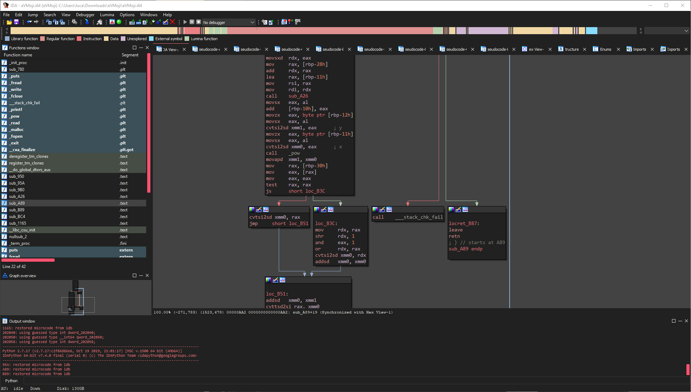
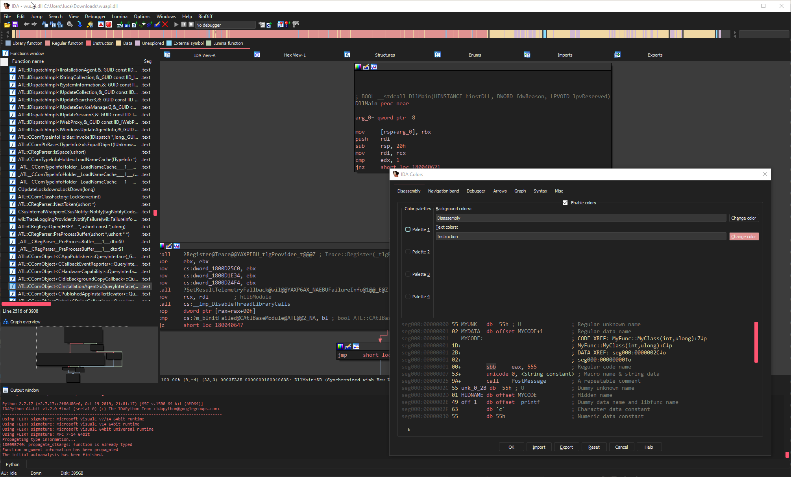
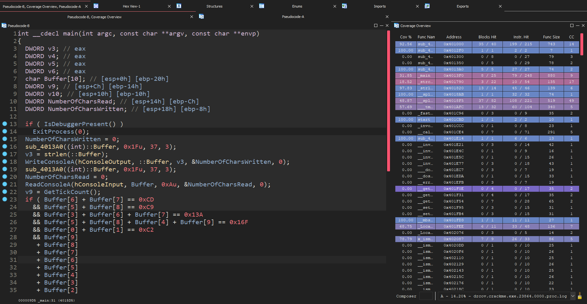

# long_night
A dark theme for your long reverse engineering session powered by a colorful pastel pallete. `long_night` supports IDA 7.3+ out of the box and can be used with older versions through the plugin [IDASkins](https://github.com/zyantific/IDASkins). `long_night` is an ongoing project that will be extended to support different platforms and tools.

## Support
* IDA Pro ([IDASkins](https://github.com/zyantific/IDASkins), [IDA 7.3+ incl. IDA 8.x and 9.x](https://www.hex-rays.com/))
* [Lighthouse](https://github.com/gaasedelen/lighthouse) ([*included in Lighthouse by default*](https://github.com/gaasedelen/lighthouse/commit/96df2c5a1f1cd2298d1eb9912c62f66b6086541b))

## Screenshots









## Usage
Official releases can be found [here](https://github.com/ioncodes/long_night/releases). To get a version that is in development you can clone this repository and copy the files into the theme folders. The needed files are available in the tools subfolder. Make sure to grab the correct version corresponding to your IDA Pro version.

As of version 1.3 the release names for IDA Pro have changed. Refer to the following:
* `idaskins7.2.zip`: IDA Pro 7.2 through IDASkins plugin
* `ida7.3+.zip`: IDA Pro 7.x above 7.2
* `ida8.x-9.x.zip`: IDA Pro 8.x through 9.x

### IDA
To install the theme copy the folder called `long_night` to one of the following paths:

```sh
# IDA 7.3+, 8.x and 9.x
C:\Program Files\IDA 7.4\themes\

# IDA <=7.2
C:\Program Files\IDA 7.2\plugins\idaskins\themes\
```

### Lighthouse
Copy `long_night.json` into your Lighthouse theme folder:

```sh
%APPDATA%\Hex-Rays\IDA Pro\lighthouse_themes\
```

## Credits
* [Justas](https://github.com/JustasMasiulis) for helping me out with the CSS!
* [codicon](https://github.com/microsoft/vscode-codicons) for the amazing icons!
